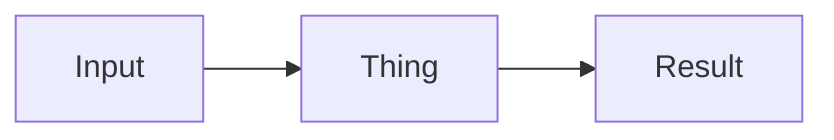

## N. Step name

> One-line summary: what it is and why it exists.

```mermaid
flowchart LR
    A[Input] --> B[Thing] --> C[Result]
```

| Setting | Value | Why |
|---|---|---|
|  |  |  |

**Verify:** how to prove it works (command or Portal path).

**Gotchas**
-